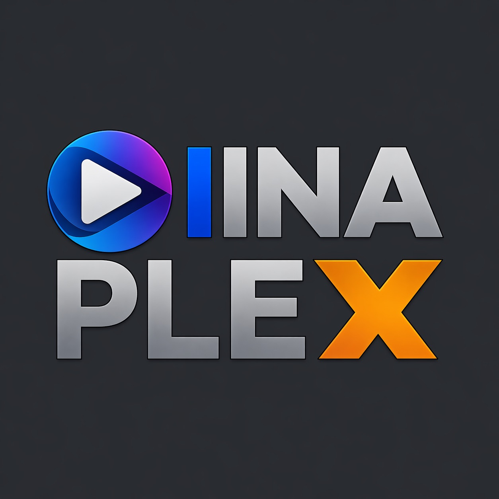
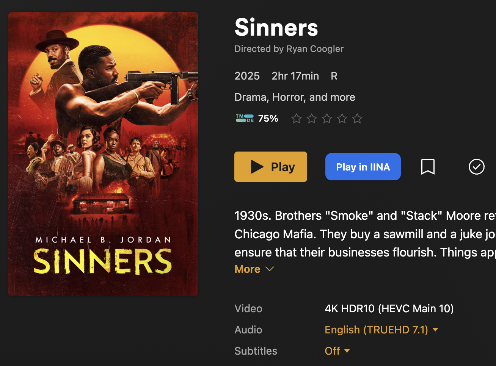
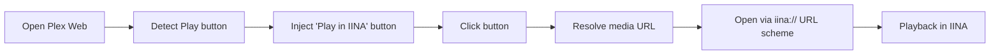

<p align="center">
  
</p>

<h1 align="center">IINAplex</h1>

<p align="center">
  Play Plex videos directly in IINA with a single click.
</p>

<p align="center">
  
  
  
  
  <a href="LICENSE"></a>
</p>

> Plex in the browser is convenient.  
> IINA is better for actually watching things.  
> IINAplex bridges that gap.

<p align="center">
  
</p>

## Overview

IINAplex is a Manifest V3 browser extension that adds a **“Play in IINA”** button directly to Plex Web.

Instead of relying on Plex’s web player, you can open the exact same media instantly in IINA, giving you better playback performance, native controls, and full desktop player features.

No server, no setup pipeline, no external dependencies — just load the extension and use it.

---

## What It Does

- Adds a **Play in IINA** button next to Plex’s play controls
- Extracts the direct media stream URL from Plex
- Opens that stream using the `iina://` URL scheme
- Falls back across multiple strategies to reliably resolve media
- Works on both local Plex servers and hosted Plex Web

---

## How It Works

At a high level, IINAplex:

1. Detects when you're viewing a playable item in Plex Web  
2. Injects a **Play in IINA** button into the UI  
3. Resolves the actual media file URL  
4. Sends that URL to IINA via a custom protocol  



---

## Media Resolution Strategy

Plex does not expose direct media URLs in a simple way, so the extension uses multiple approaches:

### 1. “More” Menu Scraping
- Opens the **More (…) menu**
- Searches for download or stream links
- Scores and selects the most likely direct media URL

### 2. Metadata Resolution
- Extracts the internal Plex metadata key from the URL
- Fetches metadata (JSON/XML)
- Locates the actual media **Part** key
- Builds a direct downloadable stream URL

### 3. Token Discovery
- Scans:
  - `localStorage`
  - `sessionStorage`
  - page links
- Extracts valid `X-Plex-Token` values
- Retries requests with discovered tokens

This layered approach makes the extension resilient across different Plex setups.

---

## Supported Environments

| Environment | Status |
|--------|--------|
| `app.plex.tv` | Supported |
| Local Plex (`localhost:32400`) | Supported |
| Remote Plex servers | Supported (with token resolution) |

---

## Installation

1. Download or clone this repository  
2. Open your browser’s extensions page  
3. Enable **Developer Mode**  
4. Click **Load unpacked**  
5. Select the project folder  

Then:

- Open Plex Web
- Navigate to any movie or episode
- Click **Play in IINA**

---

## Project Structure

```text
.
|-- manifest.json
|-- background.js
|-- content.js
```

### File Guide

- `manifest.json`  
  Declares permissions, content scripts, and extension configuration

- `background.js`  
  Handles communication and opens IINA via the `iina://` protocol

- `content.js`  
  Injects UI, detects playback context, and resolves media URLs

---

## Key Implementation Details

### Opening in IINA

The extension builds a custom URL:

```
iina://open?url=<encoded_media_url>
```

Optional flags include:

- `full_screen=1`
- `pip=1`
- `enqueue=1`
- `new_window=1`

This is executed by injecting a temporary `<a>` element and triggering a click.

---

## Local Development

No build step required.

1. Edit source files  
2. Reload the extension  
3. Refresh Plex Web  

That’s it.

---

## Debugging

Open DevTools on Plex Web and:

- Watch console logs (`[Plex IINA bg]`)
- Inspect injected button behavior
- Verify resolved media URLs

If playback fails:

- Check whether a valid media URL was found
- Verify your Plex session token is accessible
- Try both resolution strategies (menu + metadata)

---

## Privacy

IINAplex is completely local:

- No backend
- No analytics
- No tracking
- No external requests (outside Plex itself)

All logic runs in your browser.

---

## Limitations

- Depends on Plex Web DOM structure (UI changes may break it)
- Requires IINA installed on macOS
- Not tested on non-Chromium browsers
- No UI settings or configuration panel

---

## Roadmap Ideas

- Playback options UI (fullscreen, PiP, queue)
- Keyboard shortcut to trigger IINA playback
- Support for playlists / seasons
- Improved multi-part media handling
- Better UI integration with Plex themes

---

## License

MIT License
